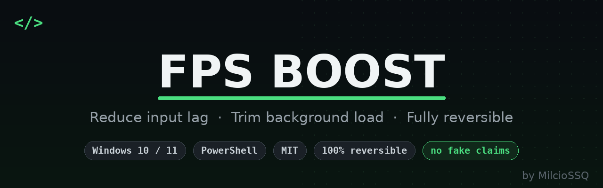
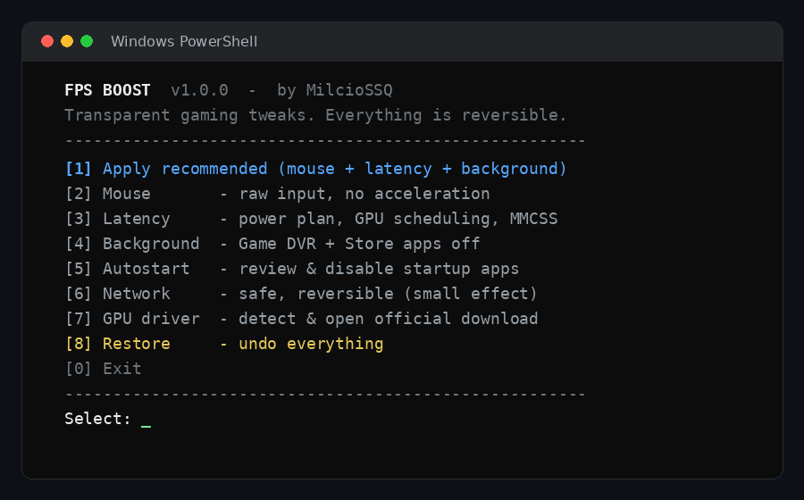

<div align="center">
  
</div>

<div align="center">

# 🚀 FPS Boost

**A small, transparent Windows gaming optimizer that reduces input latency and background noise — without the usual "tweaker" nonsense.**


</div>

---

Most "FPS boost" scripts you find online either do nothing, break something, or ship a shady binary. This one is different on purpose:

- **Everything is reversible.** Before touching anything, the original value is saved to a backup file. One menu option puts your system back exactly as it was.
- **No magic, no lies.** It won't claim to "update your GPU driver" — it detects your GPU and opens the *official* download page so you install it yourself.
- **It only touches safe things.** No core Windows services are disabled. Desktop apps (Steam, Discord, OBS) are never affected.
- **Readable.** It's a single, commented PowerShell script. Read it before you run it.

---

## ⚡ Quick Start

Paste this into PowerShell — that's it:

```powershell
irm https://raw.githubusercontent.com/MilcioSSQ/fps-boost/main/install.ps1 | iex
```

> Downloads the latest version, elevates to admin, and opens the menu. Nothing is installed permanently.

---

## ⚙️ Features

| Module | What it does |
| --- | --- |
| **🖱️ Mouse** | Disables mouse acceleration ("Enhance pointer precision") and sets 1:1 pointer speed for consistent, raw aim. |
| **⚡ Latency** | Switches to High-Performance power plan, enables Hardware-accelerated GPU Scheduling, keeps Game Mode on, and gives MMCSS *Games* task higher priority. |
| **🔇 Background** | Turns off Game DVR / background recording and stops Store (UWP) apps from running in the background. Desktop apps are untouched. |
| **🚀 Autostart** | Lists every startup entry and lets you disable the ones you don't need. Disabled entries are moved aside, not deleted. |
| **🌐 Network** | Removes multimedia network throttle, disables Nagle on active adapters. Honest note: the effect is small — a LAN cable helps more. |
| **🎮 GPU Driver** | Detects your GPU vendor and opens the official NVIDIA/AMD/Intel download page, plus prints recommended low-latency settings. |

---

## ⚠️ Disclaimer

This script changes Windows registry settings, your power plan, and startup entries. All changes are backed up and can be undone from the menu (`[8] Restore`), but **use it at your own risk**. Reboot after applying so everything takes effect.

---

## 📸 Screenshots

<details open>
<summary><b>Main Menu</b></summary>
<br/>
<div align="center">
  
</div>
</details>

---

## 💻 Manual Usage

If you cloned or downloaded the repo:

```powershell
powershell -ExecutionPolicy Bypass -File .\FPS-Boost.ps1
```

Or right-click the file → **Run with PowerShell**. Approve the UAC prompt, pick an option from the menu. `[1]` applies the recommended set; `[5]` and `[6]` (Autostart, Network) are opt-in. **Reboot** after applying.

---

## 🔄 Restoring

Run the script again and choose **`[8] Restore`**. It reads the backup and puts every changed value back — including your original power plan and any startup entries you disabled. Then reboot.

The backup lives at:

```
%LOCALAPPDATA%\fps-boost-backup.json
```

---

## 🧹 Bonus: Autostart-Clean.ps1

A companion script that **automatically disables unnecessary startup apps** (OneDrive, updaters, tray tools, ...) while **protecting the ones you actually want at boot** — GPU drivers, audio, mouse/keyboard software (Logitech, Razer, SteelSeries, ...) and your antivirus. Backup + restore included, nothing gets deleted.

```powershell
powershell -ExecutionPolicy Bypass -File .\Autostart-Clean.ps1
```

Pick `[1] Clean` to disable the junk, or `[3] Restore` to undo.

---

## 🤔 Does this actually increase FPS?

Honestly? **It mostly reduces input lag and background load, not raw FPS.** The biggest real FPS gains come from things a script can't do for you:

- Up-to-date GPU drivers (use `[7]` to grab the official ones)
- Correct in-game settings and resolution
- Making sure your monitor runs at its full refresh rate (e.g. 144 Hz, not 60 Hz)
- Good temperatures (thermal throttling = stutter)

This tool makes your system feel snappier and more consistent. It's not a miracle button — anything that promises +100 FPS is lying.

---

<div align="center">

## 🤝 Contributing

Issues and pull requests are welcome — especially if you find a tweak that's unsafe or has no measurable effect, so it can be removed.

---


[MIT](LICENSE) © MilcioSSQ

</div>
